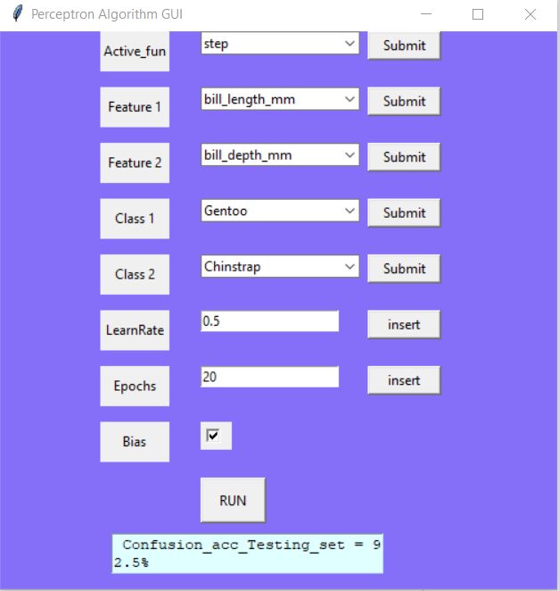

# Perceptron-Algorithm
Percpetron algorithm with gui interface to control the inputs of features and classes and show final accuracy
I have used TKinter to draw the hui iterface 
- here our task is to determine:
  - which 2 features to use 
  - which 2 class to compare 
  - which number of epochs 
  - which kind of activation function 
  - which value of the Learning rate
  - whether to add bias or not
  
  
